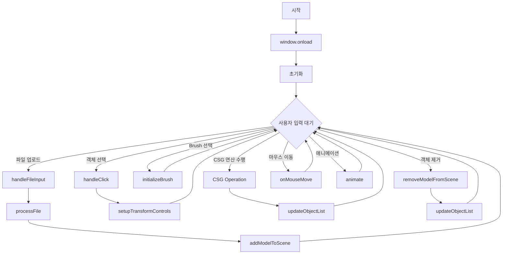
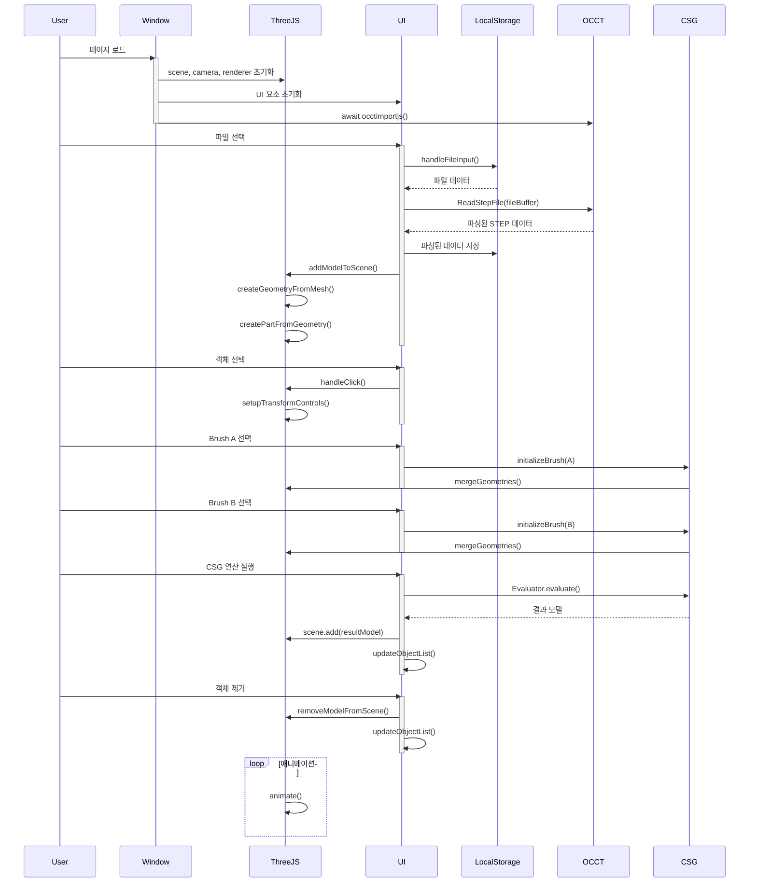

# three-step-explorer

```shell
$> npm i
$> npm run dev
```

## 1. 프로젝트 개요

본 프로젝트는 웹 기반의 3D CAD 모델 뷰어 및 CSG(Constructive Solid Geometry) 연산 도구를 개발하는 것을 목표로 합니다. 이 애플리케이션은 STEP 파일 형식의 CAD 모델을 로드하고 표시할 수 있으며, 사용자가 모델을 조작하고 CSG 연산을 수행할 수 있는 기능을 제공합니다.

## 2. 주요 기능

### 2.1 파일 업로드 및 관리

- STEP(.stp, .step) 파일 업로드 기능
- 업로드된 파일 목록 관리
- 파일 삭제 기능

### 2.2 3D 모델 뷰어

- Three.js를 사용한 3D 모델 렌더링
- 모델 회전, 확대/축소, 이동 기능
- 그리드 및 축 표시

### 2.3 모델 조작

- TransformControls를 이용한 모델 이동, 회전, 크기 조절
- 모델의 코너 포인트를 이용한 직관적인 변형

### 2.4 CSG 연산

- 두 개의 모델을 선택하여 CSG 연산 수행
- 현재는 뺄셈(Subtraction) 연산 지원

### 2.5 사용자 인터페이스

- 사이드바를 통한 파일 및 객체 목록 관리
- 버튼 인터페이스로 CSG 연산 수행

## 3. 기술 스택

- 프론트엔드: HTML, CSS, JavaScript
- 3D 렌더링: Three.js
- CAD 파일 처리: occt-import-js
- CSG 연산: three-bvh-csg

## 4. 구현 세부사항

### 4.1 파일 업로드 및 관리

- FileReader API를 사용하여 로컬 파일 시스템에서 STEP 파일 읽기
- 업로드된 파일 정보를 LocalStorage에 저장하여 세션 간 유지

### 4.2 3D 모델 렌더링

- Three.js의 Scene, Camera, Renderer를 사용하여 3D 환경 구성
- OrbitControls를 이용한 카메라 제어
- 그리드 및 축 헬퍼 추가로 공간 인식 개선

### 4.3 모델 조작

- TransformControls를 이용한 직관적인 모델 변형
- 모델의 코너에 구체를 배치하여 사용자가 쉽게 선택하고 조작할 수 있도록 함

### 4.4 CSG 연산

- three-bvh-csg 라이브러리를 사용하여 CSG 연산 구현
- 두 모델을 선택하고 뺄셈 연산을 수행하는 기능 구현

### 4.5 사용자 인터페이스

- 사이드바에 파일 목록과 씬 객체 목록 표시

### 5. 향후 개선 사항

- 다양한 CSG 연산(합집합, 교집합) 추가
- 성능 최적화 (대용량 모델 처리)
- 다중 파일 동시 업로드 지원
- 사용자 정의 메터리얼 및 색상 적용 기능
- 내보내기 기능 (수정된 모델을 STEP 또는 다른 형식으로 저장)
- UI 개선




